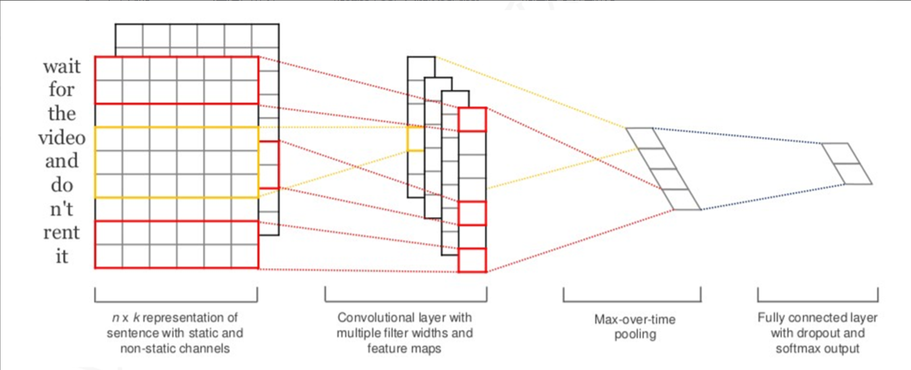

# 情感分析 实验报告

### 模型的结构图与流程分析

#### TextCNN
如下图




TextCNN的本质是卷积神经网络，由于神经网络的输入要求是向量，因此首先将文本拆分为词汇之后，对于每一个词做词向量嵌入将其转化为词向量，再将词向量输入CNN中进行如下操作：
- 卷积：使用高度为```[3, 5, 7]```的卷积核分别对输入张量（词向量构成的张量，维度为```[batch_size, 1, seq_len, embed_size]```）进行卷积，得到结果为```[batch_size, kernel_size, sqe_len - kernel_size + 1, 1]```的输出向量
- 池化：采用最大池化，对卷积输出的向量进行降维处理，得到三组维度为```[batch_size, kernel_size]```的输出
- 全连接：将三组池化后的结果进行拼接，得到全连接层的输入，为了防止过拟合作随机失活，之后进入全连接层，得到二维输出
- 输出：对全连接层的输出进行```log_softmax```后输出

#### LSTM
如下图


LSTM为RNN的一种实现，其主要的方法是通过记忆单元$C_{n}$实现了长距离的依赖关系，四个门的作用分别为：
- 遗忘门：根据输入决定丢弃记忆元中的一部分
- 输入门：根据输入决定丢弃记忆元更新量中的一部分
- 候选门：根据输入决定记忆元的更新量
- 输出门：根据新记忆元与输入决定输出

```torch.nn.LSTM```会将每一个隐含状态做线性加权为标量之后拼接为最终的输出，因此我采用了编码器-解码器模型，编码器层为```LSTM```，解码器层为全连接层，将```LSTM```得到的输出展平为```[batch_size, seq_len * hidden_size * num_dire]```维度之后输入到解码器中，再经```log_softmax```得到最终输出  

同时为了保证能够得到前向和后向的依赖关系，采用了双向```LSTM```的模型

#### MLP


MLP作为baseline，实现主要是分为三层：
- 嵌入层：将句子嵌入形成词向量并展平为```[batch_size, embed_size * seq_len]```维
- 隐藏层：一共有4个隐藏层，输出维度分别为128, 64, 32, 2
- 输出层：对于最后一个隐藏层的输出做```log_softmax```之后输出

### 实验结果分析
实验对于模型的参数分别进行了调整，得到的准确率与F-score均达到了80%以上，不同参数下最优效果具体数值如下：
|         | TextCNN |  LSTM   |   MLP   |
|:-------:|:-------:|:-------:|:-------:|
| Accuracy| 84.55%  | 85.91%  | 83.47%  |
| F-score | 84.47%  | 85.87%  | 83.65%  |

对应的参数分别为：
- TextCNN: ```lr = 0.001, batch_size = 128```
- LSTM: ```lr = 0.001, batch_size = 16```
- MLP: ```lr = 0.001, batch_size = 64```

### 不同参数效果
实验中对于不同的```batch_size, learning-rate```进行了尝试，得到变化情况如下：
- ```lr```：相同模型下，```lr```过大或过小都会明显降低模型效果，在```0.001```附近取到最优解
- ```batch_size```：受到模型和```lr```的共同制约，总体也呈现出单峰的形式，但是对于模型效果的影响没有```lr```大，例如在```lr = 1e-5```的时候，无论```batch_size```如何变化，模型的效果都较差

变化原因分析如下：
- ```lr```过大(>0.05)或过小(<5e-4)时模型效果会有显著下降，因为当学习率太大时每次下降的步幅过大，导致很容易跨过最优解而陷入循环，当其过小则会导致收敛过慢，在较少的epoch下难以收敛到一个较优的结果
- ```batch_size```的大小对模型效果的影响具体与模型有关，并且其会显著影响训练速度，因为对于每一个```batch```模型需要再训一遍，因此所需要的时间会增加
- 当```lr```与```batch_size```都在一个合理的范围内时，例如```0.01 >= lr >= 0.0001```， ```128 >= batch_size >= 32```时，模型的效果只有微小的浮动，这可能是因为模型已经到达了平台，如果想要进一步提升需要修改模型而不是调参

### 效果差异

通过观察```pipeline.py```生成的```./logs```下的训练日志可以观察出：
- 当```lr```较大的时候，TextCNN与LSTM都存在明显的过拟合现象，尽管训练epochs数量已经降到了10左右，在训练集和验证集上的损失函数仍有很大差距
- LSTM的训练速度（损失下降速度）最快，TextCNN其次，MLP最慢
- 三者的效果上没有过于明显的差异，都可以达到80%+的准确率与F-score，这可能是因为本次任务较为简单，不同模型之间没有很大的差距

### 问题思考

1. 我采用的方式是选择泛化损失最低的模型，在每一个epoch结束之后，在验证集上对其进行测试，如果其损失函数有所下降，则将这个模型保存下来，如果没有下降则不作操作。最终选择保存的模型在测试集上进行测试。
   固定epoch和随着验证集变化epoch相比，优缺点如下：
   - 优势：实现简单，对算力要求更低，训练时间短，可以拓展训练集
   - 劣势：容易出现过拟合或欠拟合，对于不同模型的适配程度不够高
2. 模型参数主要分为两部分——初始词向量与权重偏置参数，前一部分为通过给定的```word2vec```文件进行初始化，并且允许后期训练，后一部分为```torch```库隐式初始化，经过阅读源码得到的初始化方式如下：
   - LSTM: $w_{i}, b_{i} \sim \mathrm{U}(-\sqrt{k}, \sqrt{k}), k = \frac{1}{\text{hidden\_size}}$
   - TextCNN(Conv): $w_{i}, b_{i} \sim \mathrm{U}(-\sqrt{k}, \sqrt{k}), k = (C_{in} * \prod\limits_{i}(\text{kernel\_size}[i]))^{-1}$
   - MLP(Linear): $w_{i}, b_{i} \sim \mathrm{U}(-\sqrt{k}, \sqrt{k}), k = \frac{1}{\text{in\_feature\_size}}$

    都是采用的均匀初始化的方式，是类似kaiming分布的方式，其均匀分布的范围是根据相关输入数据的大小来决定的  
    常见的分布还有如下几种：
    - 零初始分布：将所有的$w_{i}, b_{i}$都初始化为0，这会带来**对称失效**——也即对于同一个神经网络，其内部参数都是相同的，导致神经网络退化为近似的线性网络
    - 高斯分布：采用正态分布进行选取，将所有的参数随机在$\mu = 0$的一个正态分布中，并进行等比例缩小，为了防止在激活函数的时候输入过大导致导数太小，学习速度降低
    - 正交初始化：采用正交矩阵的方式初始化参数，将参数初始化为正交矩阵（过高的维度会被展平）能够更好提升不同参数之间的关系
    - Xavier初始化：$w_{i}, b_{i} \sim \mathrm{U}(-\sqrt{k}, \sqrt{k}), k = c \sqrt{\frac{6}{\text{in\_fea\_size} + \text{out\_fea\_size}}}$
3. 过拟合问题主要是因为神经网络的参数过多、训练次数过多等因素导致的，因此可以通过减少层数、根据模型改变epoch数量等方法来避免过拟合。  
   在我的实现中，我采用了测算泛化损失的方法，选择泛化损失最小的一个模型，从而在测试集上测试时所采用的模型的训练epoch数是随着模型变化而变的。
   并且在TextCNN和MLP的实现中，我降低了最后的全连接层的数量，最终只使用了一层全连接层
4. 优缺点：
    - TextCNN：优势是模型相对来说较简单，由卷积、池化、全连接层组成，训练时间较短；缺点是效果与MLP差距较小，同时维度处理比较复杂
    - LSTM：优势是结果较优，并且在各种合理的参数下所取得的结果在三个模型中是最好的；缺点是模型复杂，参数较多，训练时间长
    - MLP：优势是模型简单，易于理解；缺点是效果较差，只在很少的一部分参数下有较好的效果

### 心得体会

通过本次实验，我深入理解了跟神经网络有关一系列内容，例如词嵌入的实现、激活函数的选取、全连接层数与输入输出维度的选取、卷积核大小的选取、池化方式的选取等，这让我体会到了大模型具有充分的自由性，但是由于算力和资源等原因，我没办法将每一种方案都实现并测试、比较，因此我了解了神经网络的有关知识及其背后的数学原理，根据这次任务的难度实现了相对应的模型，并且还对学习率与批大小这两个量进行了调参实验，为了防止过拟合与欠拟合还学习了泛化损失和验证方法等。  
总而言之，本次实验是我第一次完整的实现一个可以使用的神经网络，让我对于这个当前炙手可热的领域有了一定了解，也让我更深刻的认识到了神经网络背后的本质
